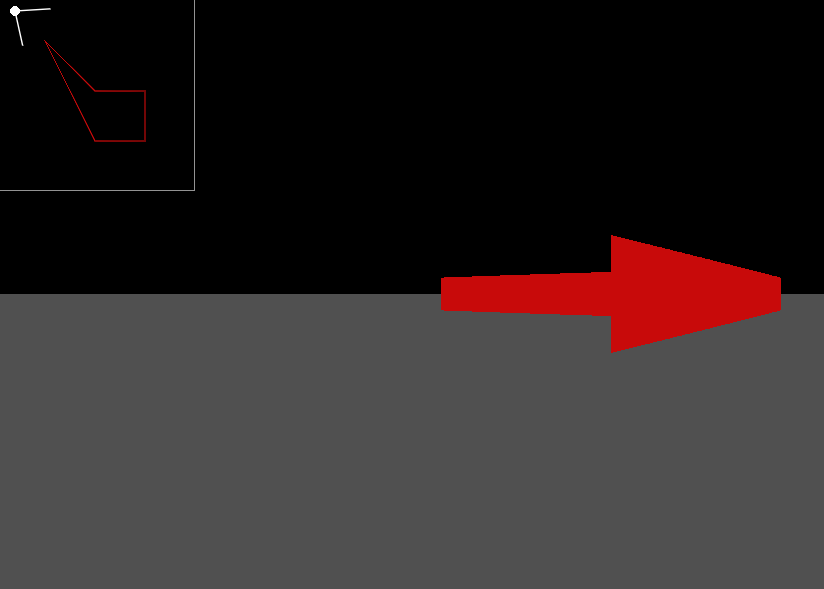

# Simple 2D raycasting test

This is a personal project where the code is not pretty. The goal of this was to
just learn how raycasting works and how to implement it using the [Love2D](https://love2d.org) framework.

## Starting

To run this project you need to install [Love2D](https://love2d.org) yourself.
There is a great tutorial on how to do all of this [here](https://love2d.org/wiki/Getting_Started).

## Controls

* W - Walk forward
* S - Walk backward
* Q - Turn left
* E - Turn right
